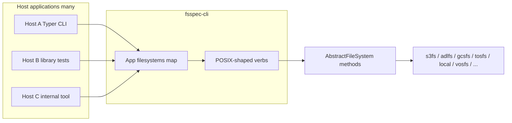

# Spec: fsspec-cli

A library that turns a map of live [fsspec](https://filesystem-spec.readthedocs.io/)
`AbstractFileSystem` instances into POSIX-shaped command verbs (`ls`, `cp`, `mv`, `rm`,
`mkdir`, `stat`, …) for embedding in any Typer (or argv-driven) host application.

| Field | Value |
| --- | --- |
| Status | Local draft |
| Date | 2026-07-15 |
| Project name | **fsspec-cli** |
| Import | `from fsspec_cli import App` |
| Repository (interim) | [`shinybrar/vosfs`](https://github.com/shinybrar/vosfs) at `src/fsspec_cli` |
| Why that repo | Share existing CI / release-please / publish automation while the library matures; a later extract to its own repository is allowed but not required for v1 |
| Normative behavior | [Open Group Base Specifications Issue 8 / IEEE Std 1003.1-2024](https://pubs.opengroup.org/onlinepubs/9799919799/) (utility pages) |
| Engine dependency | [fsspec](https://github.com/fsspec/filesystem_spec) + [Typer](https://typer.tiangolo.com/); optional FUSE via `fsspec[fuse]` |

This document is the **only** local specification for the project. It is self-contained: no
references to other markdown files. External URLs are allowed.

---

## 1. Problem statement

Developers who already construct fsspec filesystems (S3, Azure, GCS, TOS, local disk,
VOSpace, memory, …) need a **drop-in** way to expose familiar POSIX shell verbs over those
instances—including **multiple mounts that share one fsspec protocol** (e.g. two different
S3 endpoints)—without:

- Re-implementing `ls`/`cp`/`mv` output and flags in every product
- Depending on `universal_pathlib` / UPath
- Adopting a heavy grid-oriented CLI
- Forcing URL/`protocol` + `storage_options` as the only way to name mounts
- Shipping a competing end-user binary that every host must re-brand around

No widely marketed package today accepts “here is `dict[str, AbstractFileSystem]`” and
returns POSIX-shaped verbs. fsspec itself exposes POSIX-**named** Python methods, not a
shell. Closest near-misses are URL-driven (`gfal`) or protocol-specific (`dav` / webdav4,
rclone, cloud vendor CLIs).

## 2. Solution

Provide **fsspec-cli**: a small library whose public surface is:

```python
from fsspec_cli import App

app = App({"prod": fs_a, "staging": fs_b, "local": local_fs})
host_typer.add_typer(app.typer_app, name="data")   # example host wiring
# or
app.main(["ls", "-lah", "prod:/bucket/prefix"])
```

- Hosts own authentication, endpoint discovery, branding, and the console entry point.
- fsspec-cli owns path grammar (`name:/path`), verb implementations, POSIX Issue 8–aligned
  flag/output/exit behavior for a **documented subset** of options, and cross-mount copy.
- v1 ships **no** `console_scripts` entry point.



---

## 3. Locked decisions

1. **Live instance map** — Primary API is `Mapping[str, AbstractFileSystem]`. Reject
   protocol/`storage_options` construction and process-global `register()` as the primary seam.
2. **Logical mount names** — Keys in the map are mount names, **not** fsspec protocol strings.
3. **Call fsspec directly** — Use `ls`, `info`, `get`/`put` / `get_file`/`put_file`, `rm`,
   `mkdir`, `mv`, `copy` — **no UPath**.
4. **POSIX Issue 8** — Normative for supported flags and stdout/stderr/exit conventions; implement
   a documented subset (most-used first), not the full utility option matrix.
5. **Library only in v1** — No released end-user CLI from this package; hosts embed
   `.typer_app` or call `.main(argv)`.
6. **Interim home** — Develop under [`shinybrar/vosfs`](https://github.com/shinybrar/vosfs)
   `src/fsspec_cli` to reuse that project’s automation and release train.
7. **Rich / fancy TUI** — Out of scope; human output is plain POSIX-shaped text.
8. **Auth** — Always outside fsspec-cli; the caller builds configured filesystem instances.

### Naming history (rejected)

| Idea | Why not |
| --- | --- |
| Dist/import `fscli` | [PyPI FSCLI](https://pypi.org/project/fscli/) already taken (unrelated) |
| Import `f2p` | [PyPI f2p](https://pypi.org/project/f2p/) already taken |
| Separate `shinybrar/fsspec-cli` repo immediately | Deferred; vosfs hosting preferred for CI/release while progressing |
| UPath-based core | Pathlib convenience only; does not replace verbs or simplify the mount-map design |

**PyPI note:** A stub project named [`fsspec-cli` 0.0.1](https://pypi.org/project/fsspec-cli/)
exists (“A small example package”). Reclaim or choose an alternate distribution name at first
publish; the **import** remains `fsspec_cli`.

---

## 4. Public API

```python
from collections.abc import Mapping, Sequence
from typing import Any

from fsspec.spec import AbstractFileSystem
import typer

class App:
    def __init__(self, filesystems: Mapping[str, AbstractFileSystem]) -> None:
        """Bind logical mount names to live filesystem instances."""

    @property
    def typer_app(self) -> typer.Typer:
        """Typer app exposing v1 verbs for host composition (add_typer)."""

    def main(self, argv: Sequence[str] | None = None) -> Any:
        """Invoke verbs from argv (default: sys.argv[1:])."""

def run(
    filesystems: Mapping[str, AbstractFileSystem],
    argv: Sequence[str] | None = None,
) -> Any:
    """Convenience: App(filesystems).main(argv)."""
```

### Why live instances (not protocol URLs)

fsspec caches instances by constructor token and resolves many helpers by **protocol string**.
Two `S3FileSystem` objects with different `endpoint_url` / credentials cannot both be addressed
as `s3://…` without colliding. Mount names fix that:

```python
from s3fs import S3FileSystem
from fsspec_cli import App

filesystems = {
    "prod": S3FileSystem(endpoint_url="https://s3.prod.example", skip_instance_cache=True, ...),
    "staging": S3FileSystem(endpoint_url="https://s3.staging.example", skip_instance_cache=True, ...),
}
App(filesystems).main(["cp", "-r", "prod:/bucket/a", "staging:/bucket/a"])
```

The same pattern applies to any backend that reuses one protocol for many deployments
(e.g. two VOSpace services both registered as `vos`).

### Path grammar

| Input | Meaning |
| --- | --- |
| `name:/path` | Look up mount `name`; pass `path` (only) into filesystem methods |
| Bare `./x`, `/tmp/x`, `~/x`, relative names | **Local** — allowed as `cp` / `mv` operands only |
| `ls` / `stat` / `mkdir` / `rm` targets | **Require** explicit `name:` |

Rules:

1. Split on the first `:` that separates mount name from path (mount names cannot contain `:`).
2. Unknown mount → error listing known mounts.
3. Never pass `name:/path` into the backend; backends only strip **their** protocols.
4. Hosts that want bare-local `cp`/`mv` should supply a `local` (or equivalent) mount, or the
   library documents an implicit `LocalFileSystem` policy for bare operands.

### Invocation shape (as embedded by hosts)

```text
<host> ls   [-l|-a|-h|…] NAME:/PATH
<host> stat NAME:/PATH
<host> mkdir [-p] NAME:/PATH
<host> rm   [-r|-f|…] NAME:/PATH
<host> cp   [-r] SRC DEST
<host> mv   SRC DEST
# stretch
<host> mount NAME:/PATH MOUNTPOINT
```

Hosts choose the group name (`data`, `fs`, `storage`, …). fsspec-cli does not.

---

## 5. Verbs and POSIX

### v1 verbs

`ls`, `cp`, `mv`, `rm`, `mkdir`, `stat`

Stretch: `mount` via [`fsspec.fuse.run`](https://filesystem-spec.readthedocs.io/en/latest/api.html#fsspec.fuse.run)
(experimental upstream).

### Normative references

- Utilities index: <https://pubs.opengroup.org/onlinepubs/9799919799/idx/utilities.html>
- Per-verb pages, including:
  - [ls](https://pubs.opengroup.org/onlinepubs/9799919799/utilities/ls.html)
  - [cp](https://pubs.opengroup.org/onlinepubs/9799919799/utilities/cp.html)
  - [mv](https://pubs.opengroup.org/onlinepubs/9799919799/utilities/mv.html)
  - [rm](https://pubs.opengroup.org/onlinepubs/9799919799/utilities/rm.html)
  - [mkdir](https://pubs.opengroup.org/onlinepubs/9799919799/utilities/mkdir.html)

### Compliance philosophy

- **Maximum compliance for the flags we ship**, not full Issue 8 option parity.
- Document each supported flag against the utility page (or mark explicit extensions, e.g.
  human-readable size `-h` if treated as an extension).
- Default `ls` listing: one entry per line on stdout (aligned with POSIX default for the
  non-multicolumn case).
- Diagnostics on stderr; successful listings/data on stdout.
- Exit status: non-zero on failure for supported error cases, consistent with the utility specs.
- Remote / object-store mounts: keep flag and output **shape**; do **not** invent fake
  mode/uid/gid/mtime when `info` does not provide them.
- `stat`: best-effort formatting of fsspec `info` (not a full portable `stat(1)` clone).

### fsspec listing contract

`AbstractFileSystem.ls(..., detail=True)` / `info` require at least:

- `name` — full path without protocol
- `size` — bytes or `None`
- `type` — `"file"`, `"directory"`, or other

See [fsspec AbstractFileSystem API](https://filesystem-spec.readthedocs.io/en/latest/api.html#fsspec.spec.AbstractFileSystem).
Verb formatters use these three as the baseline; extras are optional.

### Transfers

| Case | Behavior |
| --- | --- |
| Same mount `cp`/`mv` | Prefer `fs.copy` / `fs.mv` (server-side when the backend implements it) |
| Cross mount `cp` | Temp file + `get_file` / `put_file` (same idea as [`fsspec.generic.copy_file_op`](https://github.com/fsspec/filesystem_spec/blob/master/fsspec/generic.py)) |
| Cross mount `mv` | `cp` then delete source; define fail-closed semantics (do not delete source until destination verified) |

Limitations to document: local temp disk for cross-FS; object-store directory markers; some
backends are whole-object only (no ranges); prefer sync wrappers for CLI use when backends are
async; do not route mount names through `GenericFileSystem` protocol URLs.

---

## 6. User stories

1. As an application developer, I want `App({"a": fs_a, "b": fs_b})`, so that I can expose POSIX verbs over filesystems I already built.
2. As an application developer, I want logical mount names independent of fsspec protocols, so that two S3 (or two vos) endpoints can coexist.
3. As an application developer, I want `App(...).typer_app`, so that I can mount verbs under my own Typer group name and branding.
4. As an application developer, I want `App(...).main(argv)`, so that tests and non-Typer hosts can drive verbs without a global registry.
5. As an application developer, I want no UPath dependency, so that the library stays a thin layer over `AbstractFileSystem`.
6. As an application developer, I want auth and endpoints to stay in my code, so that fsspec-cli never owns credential flows.
7. As an application developer, I want no released console script from fsspec-cli v1, so that my product owns the user-facing binary.
8. As an end user of a host CLI, I want `ls`/`cp`/`mv`/`rm`/`mkdir`/`stat` with familiar short flags (`-l`, `-a`, `-lah`, `-r`, `-p`, `-f`, … as supported), so that muscle memory from real POSIX tools transfers.
9. As an end user, I want `name:/path` to select a mount, so that multi-site or multi-account layouts are explicit.
10. As an end user, I want bare local paths on `cp`/`mv`, so that upload/download does not invent `get`/`put` verbs.
11. As an end user, I want `ls`/`stat`/`mkdir`/`rm` to require `name:`, so that remote vs local is never guessed.
12. As an end user, I want one entry per line from default `ls`, so that I can pipe and script.
13. As an end user, I want long listings that look like POSIX `ls -l` when metadata exists, so that inspection feels familiar.
14. As an end user, I want missing object-store metadata omitted rather than faked, so that output stays honest.
15. As an end user, I want diagnostics on stderr and listings on stdout, so that pipes stay clean.
16. As an end user, I want non-zero exit status on failure, so that `set -e` scripts work.
17. As an end user, I want same-mount `cp`/`mv` to use backend-efficient operations when available, so that renames are not always full relays.
18. As an end user, I want cross-mount `cp` to work across heterogeneous backends, so that I can move data between clouds or local disk with one verb.
19. As an end user, I want cross-mount `mv` to be fail-closed, so that a partial copy does not delete the source.
20. As an end user, I want optional FUSE mount later, so that browse-as-directory remains a stretch goal.
21. As a library maintainer, I want LocalFileSystem golden tests against host `ls`/`cp`/… for supported flags, so that POSIX regressions are caught without cloud credentials.
22. As a library maintainer, I want the package developed in the vosfs repository release train for now, so that CI and publishing stay one pipeline.
23. As a library maintainer, I want each supported flag documented against Issue 8 (or marked extension), so that compliance gaps are explicit.
24. As a library maintainer, I want adding a verb to mean “Issue 8 subset + tests,” so that scope stays bounded.
25. As a contributor, I want backend quirks (path strip, trailing slash) documented without forking backends inside fsspec-cli, so that compatibility stays “best-effort over AbstractFileSystem.”
26. As a consumer on s3fs, I want `prod:/bucket/key` after I constructed `S3FileSystem`, so that I do not re-encode credentials on the CLI.
27. As a consumer on adlfs, I want the same verbs over `AzureBlobFileSystem`, so that Azure is not a special case in the host.
28. As a consumer on gcsfs / tosfs / local / vosfs / memory, I want the same App contract, so that one embed path serves all.
29. As a host author, I want unknown mount names to error with the known mount list, so that users can self-correct.
30. As a host author, I want deterministic tests via injected fake or memory filesystems, so that CI needs no cloud accounts.
31. As a product owner, I want Rucio/FTS-style third-party server copy out of scope, so that this library is not blocked on transfer planes outside fsspec.
32. As a product owner, I want full POSIX option parity out of scope for v1, so that we ship useful verbs quickly.
33. As a user migrating from protocol-specific CLIs (rclone, aws s3, vostools, dav), I want a familiar verb set, so that switching hosts is mostly path-prefix learning.
34. As a developer evaluating UPath, I want a clear decision that UPath is not used, so that pathlib convenience is not confused with the CLI contract.

---

## 7. Implementation decisions

### Package layout (vosfs repo, interim)

- Path: `src/fsspec_cli/` alongside any sibling packages in that repository.
- Import package name: `fsspec_cli`.
- Dependencies: `fsspec`, `typer`; optional extra for FUSE (`fusepy` / `fsspec[fuse]`).
- No `console_scripts` in v1.
- Wheel / hatch / uv packaging details at scaffold time may expose fsspec-cli as a second
  distribution or an extra of the parent project; **import path stays `fsspec_cli`**.

### Modules (conceptual)

- `App` — holds the mount map; builds Typer app; `main`/`run`.
- Path parsing — `name:/path` and bare-local rules.
- Per-verb command modules — flag parsing + calls into fsspec + POSIX-shaped formatting.
- Cross-FS copy helper — temp get/put tree expansion.
- Optional `mount` — thin wrapper over `fsspec.fuse.run`.

### Explicit non-goals in the library

- Discovering or refreshing credentials
- Registering fsspec protocols
- Preferring any single object-store or VOSpace vendor
- Shipping host-specific group names or config file formats (hosts may add those)

---

## 8. Testing decisions

### Seams (fewest, highest)

1. **`App.main` / Typer invoke (primary)** — With `LocalFileSystem` (and/or `MemoryFileSystem`),
   assert stdout/stderr/exit for the supported POSIX subset. Optionally compare to the host OS
   real `ls`/`cp`/`mv`/`rm`/`mkdir` for the same flags on a temp directory.
2. **Path grammar** — Unit-level only as needed to lock parse errors; prefer end-to-end via `main`.
3. **Cross-FS copy** — Two mounts (memory or temp local); assert bytes and fail-closed `mv`.
4. **Host integration** — Out of scope for this package’s CI beyond embed examples/docs; each host
   tests its own mount-map builder and branding.

### What makes a good test

- External behavior only (argv in → streams and exit out).
- Do not assert private helpers as the contract.
- Do not require cloud credentials for default CI.
- Do not invent Rich widget assertions.

---

## 9. Backend compatibility

All of the following work with the **instance-map** API when the host constructs them. fsspec-cli
passes path-only strings after mount parse.

| Backend | Package / class | Protocols | Typical path after strip | Same-FS cp/mv notes | Auth (host-owned) |
| --- | --- | --- | --- | --- | --- |
| s3fs | `s3fs.S3FileSystem` | `s3`, `s3a` | `bucket` / `bucket/key` | Server-side copy; `mv` often copy+rm | key/secret/token/endpoint/… |
| adlfs | `adlfs.AzureBlobFileSystem` | `abfs`, `az`, `abfss` | `container/path` (often no leading `/`) | Server-side copy URL; `mv` default copy+rm | account/SAS/SP/DefaultAzureCredential/… |
| tosfs | `tosfs.TosFileSystem` | `tos`, `tosfs` | `bucket` / `bucket/key` | `cp_file` same-FS; Volcengine TOS | key/secret/region/endpoint/… |
| gcsfs | `gcsfs.GCSFileSystem` | `gs`, `gcs` | `bucket` / `bucket/object` | `moveTo` when possible | token/project/… |
| local | `fsspec.implementations.local.LocalFileSystem` | `file`, `local` | POSIX path | `shutil` copy/move | none |
| vosfs | `vosfs.VOSpaceFileSystem` | `vos` | Canonical `/a/b` | Copy may stage via temp; `mv` copy+rm | `endpoint_url` + token or cert |
| memory | `fsspec.implementations.memory.MemoryFileSystem` | `memory` | in-memory paths | Useful in tests | none |

**tosfs** is ByteDance / Volcengine Tinder Object Storage
([fsspec/tosfs](https://github.com/fsspec/tosfs), [PyPI tosfs](https://pypi.org/project/tosfs/)).

### Cross-FS algorithm

```text
parse src → (name1, path1); parse dst → (name2, path2)
fs1, fs2 = map[name1], map[name2]
if fs1 is fs2:
    fs1.copy(path1, path2, recursive=…)
else:
    expand file pairs from fs1; for each:
      fs1.get_file(rpath, temp)
      fs2.put_file(temp, dest)
    mkdir parents on fs2 as needed
```

---

## 10. Landscape research (why we build this)

Evaluated 2026-07-14 against primary sources (package metadata, upstream docs/source).

| Need | Verdict |
| --- | --- |
| fsspec built-in POSIX CLI | **Does not exist** — no `console_scripts`; POSIX names are Python methods |
| fsspec FUSE | **Exists** — experimental [`fsspec.fuse`](https://filesystem-spec.readthedocs.io/en/latest/features.html#mount-anything-with-fuse) |
| Generic “pass FS instance → shell verbs” | **Missing** as a small dedicated package |
| `gfal` | **Partial** — fsspec-based, URL-driven CLI; not instance-map; grid-heavy |
| `webdav4` / `dav` | Good verb **shape**; WebDAV-only |
| `universal_pathlib` | pathlib over fsspec; **no** CLI |
| rclone / aws s3 / vostools / gcsfuse | Protocol- or product-specific; not fsspec-agnostic |
| vosfs | Library + `fsspec.specs` registration; **no** CLI |

**Recommendation:** build fsspec-cli on `AbstractFileSystem` methods; reuse `fsspec.fuse` for
stretch mount; study `dav`/`gfal` verb sets for UX inspiration only — do not depend on them.

### Primary sources

- <https://filesystem-spec.readthedocs.io/en/latest/>
- <https://filesystem-spec.readthedocs.io/en/latest/api.html#fsspec.spec.AbstractFileSystem>
- <https://filesystem-spec.readthedocs.io/en/latest/features.html>
- <https://github.com/fsspec/filesystem_spec>
- <https://github.com/fsspec/s3fs>
- <https://github.com/fsspec/adlfs>
- <https://github.com/fsspec/gcsfs>
- <https://github.com/fsspec/tosfs>
- <https://github.com/fsspec/universal_pathlib>
- <https://github.com/lobis/gfal>
- <https://github.com/skshetry/webdav4>
- <https://github.com/shinybrar/vosfs>
- <https://pubs.opengroup.org/onlinepubs/9799919799/>
- <https://pypi.org/project/fsspec-cli/>
- <https://pypi.org/project/fscli/>
- <https://rclone.org/commands/>
- <https://docs.aws.amazon.com/cli/latest/reference/s3/index.html>

---

## 11. Example host embeddings

Hosts are **out of scope** for this package except as illustrations. Any product that can build
fsspec instances can embed the library.

```python
# Minimal: tests or a tiny private tool
from fsspec.implementations.local import LocalFileSystem
from fsspec.implementations.memory import MemoryFileSystem
from fsspec_cli import App

App({"local": LocalFileSystem(), "mem": MemoryFileSystem()}).main()

# Typer host (name the group whatever you want)
import typer
from fsspec_cli import App

root = typer.Typer()
root.add_typer(App(my_filesystems).typer_app, name="fs")
# users run:  myproduct fs ls -lah local:/tmp
```

Science-platform clients, data portals, and internal ops tools are all expected consumers; none
are required by this specification.

---

## 12. Out of scope

- Releasing a standalone end-user CLI binary in v1
- Full POSIX utility option parity
- Perfect `ls -l` metadata on every object store
- Owning cloud/VOSpace authentication or endpoint discovery
- Depending on vostools, rclone, gfal, or UPath
- Third-party server-to-server copy planes (Rucio, FTS, cloud TPC APIs) except insofar as a
  backend’s own `copy`/`mv` already uses them
- Immediate repository extract from vosfs (allowed later, not required)

---

## 13. Delivery sequence

1. Scaffold `src/fsspec_cli` in [`shinybrar/vosfs`](https://github.com/shinybrar/vosfs): `App`,
   path grammar, `ls` subset, LocalFileSystem golden tests; wire into existing CI/release.
2. Implement `cp`, `mv`, `rm`, `mkdir`, `stat` + cross-FS copy.
3. Document supported flag ↔ Issue 8 mapping; add embed examples.
4. Optional: `mount` via `fsspec.fuse`.
5. First publish (resolve PyPI distribution name); hosts integrate on their own schedule.

---

## 14. Done when

- [ ] `from fsspec_cli import App` works from the vosfs-train package layout
- [ ] `App(filesystems).typer_app` and `.main(argv)` expose v1 verbs
- [ ] Path grammar (`name:/path`, bare local for `cp`/`mv` only) is enforced
- [ ] Supported `ls`/`cp`/`mv`/`rm`/`mkdir` flags behave per documented Issue 8 subset on
      `LocalFileSystem`, with tests
- [ ] Cross-mount `cp` works between at least two local/memory mounts
- [ ] No `console_scripts` in v1
- [ ] No UPath dependency
- [ ] README documents embed pattern, path grammar, flag subset, and backend caveats

---

## 15. Document control

This file is the single specification for fsspec-cli. Prior split research notes and draft PRDs
were deleted in favor of this document.
